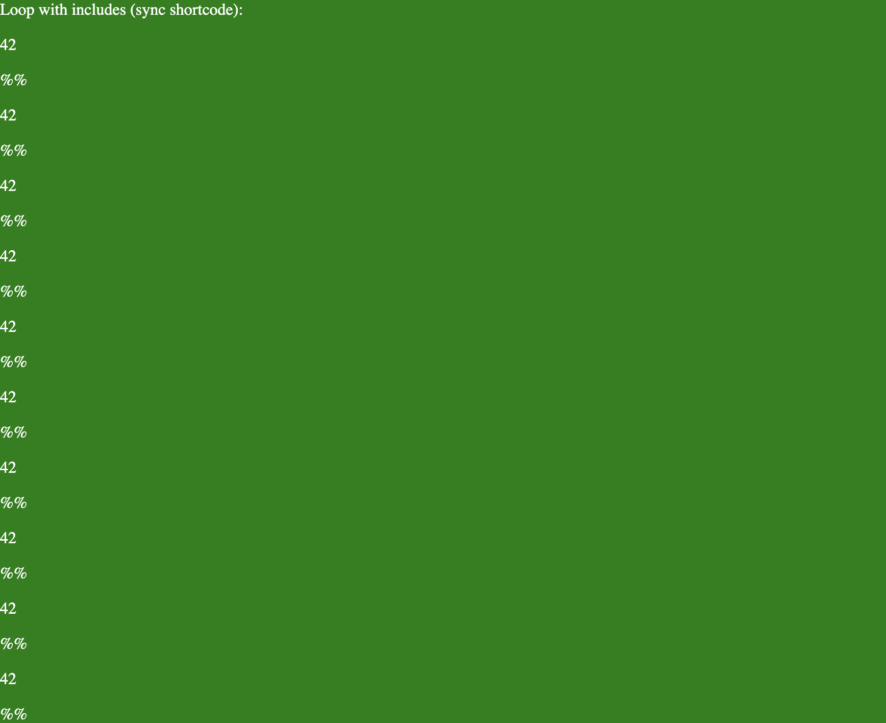

### Normal loop

In the normal loop section, we are doing a simple loop from 0 to 10, and printing the number 42 and %% on each iteration.

```twig

    42
    <p>%%</p>

```


This works as expected, and the output is correct.

### Loop with include

If we include the 42.njk file, which just contains '42', the output is also correct.

```twig

    
    <p>%%</p>

```


### Loop with include and async shortcode

If we include the `boop.njk`, which contains `` (an _async_ shortcode that returns '42'), and then do the loop, the output is incorrect.

```twig

    
    <p>%%</p>

```


The 42 is not outputted, and the %% is also not outputted.

### Loop with include and sync shortcode

However, if we include the `boopSync.njk`, which contains `` (a _sync_ shortcode that returns '42'), and then do the loop, the output is correct.

```twig

    
    <p>%%</p>

```



We see the 42 and the %% on each iteration.
